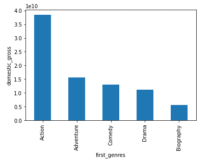

# Title

**Authors**: Abdulrahman (Abdul) Mawar

## Overview

This project looks into the types of genres that has the highest domestic gross value that have been released by merging 2 provided data to help Microsoft with their decision on what movies to produce.
***

## Business Problem

Microsoft would like to create a new studio for movie making and they wanted to know what the genre of movies that are in demand.
***

## Data

Imdb titles.csv: has numerous movies by the genres
Bom.csv – has numerous movies by the gross value, domestic and foreign
***

## Methods

Both data above were merged, and top 5 genres by the domestic gross value were extracted
***

## Results

The top genres by movie count were Drama, Action, Comedy.

The top genres by domestic gross value were Action, Adventure, Comedy
***

Here is an example of how to embed images from your sub-folder:

### Visual 1

### Visual 2


## Conclusions

There is a high demand for Action movies in the market, followed by Adventure and Comedy. However, we will need to further analyse and find out the reason behind this demand; could it be the price, the quality or is it just pure demand for it in the market. 
***

## For More Information

Please review our full analysis in [our Jupyter Notebook](./dsc-phase1-project-template.ipynb) or our [presentation](Analysis on Movies - Microsoft./DS_Project_Presentation.pdf).

For any additional questions, please contact Abdul Mawar at abdulmawar@gmail.com

## Repository Structure

Describe the structure of your repository and its contents, for example:

```
├── README.md                           <- The top-level README for reviewers of this project
├── dsc-phase1-project-template.ipynb   <- Narrative documentation of analysis in Jupyter notebook
├── DS_Project_Presentation.pdf         <- PDF version of project presentation
├── data                                <- Both sourced externally and generated from code
└── images                              <- Both sourced externally and generated from code
```
